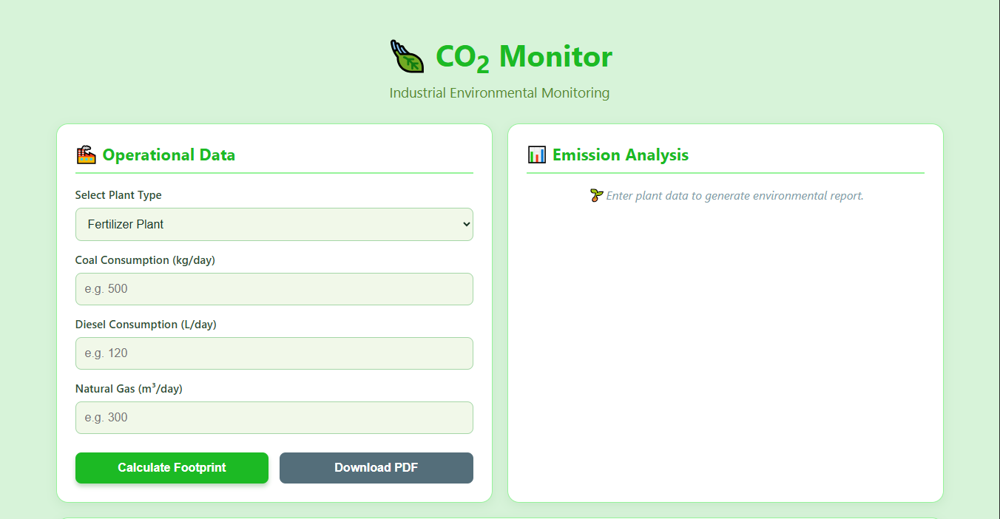
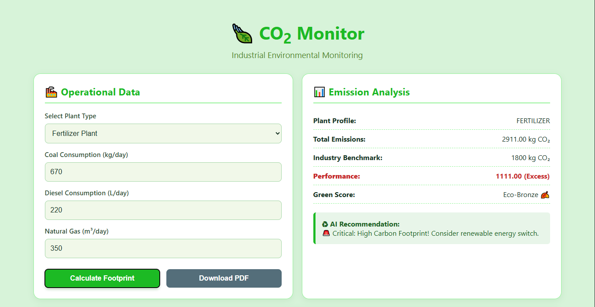
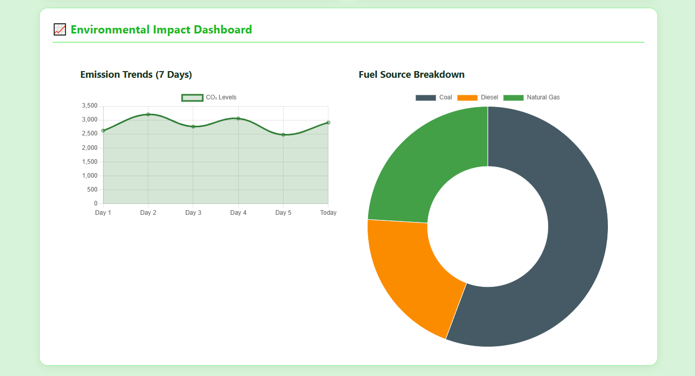

# 🌿 EcoTrack - CO₂ Emission Tracker for Chemical Industries

EcoTrack is a web-based environmental monitoring application designed to estimate carbon dioxide (CO₂) emissions generated by industrial plants based on fuel consumption. The application helps industries evaluate their environmental impact, compare emissions with industry benchmarks, receive sustainability recommendations, and visualize emission data through interactive charts.

## 🚀 Features

- 🏭 Supports multiple plant types
  - Fertilizer Plant
  - Polymer Production Plant
  - Petroleum Refinery
  - General Chemical Plant

- 📊 Calculates CO₂ emissions from:
  - Coal Consumption
  - Diesel Consumption
  - Natural Gas Consumption

- 📈 Interactive dashboard using Chart.js
  - Fuel-wise emission breakdown
  - Emission trend visualization

- 🌱 Environmental performance analysis
  - Industry benchmark comparison
  - Green Score (Eco-Gold, Eco-Silver, Eco-Bronze)
  - AI-inspired sustainability recommendations

- 📄 Export emission reports as PDF

- 📱 Responsive and user-friendly interface

---

## 🛠️ Tech Stack

| Technology | Purpose |
|------------|---------|
| HTML5 | Structure |
| CSS3 | Styling & Responsive UI |
| JavaScript (ES6) | Application Logic |
| Chart.js | Interactive Data Visualization |
| jsPDF | PDF Report Generation |

---

## 📂 Project Structure

```
EcoTrack/
│
├── index.html      # Main application interface
├── style.css       # Styling and responsive design
├── script.js       # Emission calculation and application logic
└── README.md
```

---

## ⚙️ How It Works

1. Select the plant type.
2. Enter daily fuel consumption values.
3. Click **Calculate Footprint**.
4. The application:
   - Calculates CO₂ emissions using standard emission factors.
   - Compares emissions with industry benchmarks.
   - Generates a Green Score.
   - Displays sustainability recommendations.
   - Updates interactive charts.
5. Download the environmental report as a PDF.

---

## 📊 Emission Calculation

The application estimates CO₂ emissions using predefined emission factors:

| Fuel | Emission Factor |
|------|-----------------|
| Coal | 2.42 kg CO₂ per kg |
| Diesel | 2.68 kg CO₂ per litre |
| Natural Gas | 2.00 kg CO₂ per m³ |

Total CO₂ Emission =

```
(Coal × 2.42)
+ (Diesel × 2.68)
+ (Natural Gas × 2.00)
```

---

## 🌍 Sustainability Assessment

The calculated emissions are compared with predefined industry benchmark values.

Based on the result, the system provides:

- Green Performance Score
- Benchmark comparison
- Environmental recommendations
- Fuel contribution analysis

---

## 📈 Dashboard

The dashboard provides two visualizations:

- **Fuel Source Breakdown**
  - Displays the contribution of each fuel source to total emissions.

- **Emission Trend**
  - Shows a sample emission trend over recent days for visualization purposes.

---

## 💡 Future Improvements

- Integration with real-time IoT sensor data
- User authentication
- Database storage for historical reports
- AI/ML-based emission forecasting
- Renewable energy recommendations
- Cloud deployment
- Carbon credit estimation

---

## 🎯 Applications

- Chemical Industries
- Manufacturing Plants
- Environmental Monitoring
- Sustainability Reporting
- Academic Projects
- Industrial Energy Audits

---

---

## 📸 Screenshots

### 🏠 Home Page
The landing page where users can select the plant type, enter fuel consumption details, and initiate CO₂ emission analysis.



---

### 📊 Emission Analysis
Displays the calculated CO₂ emissions, industry benchmark comparison, Green Score, and AI-powered sustainability recommendations.



---

### 📈 Interactive Dashboard
Visualizes emission data through a fuel source breakdown chart and emission trend graph, enabling better environmental performance analysis.



---

## 👨‍💻 Author

**Yash**

B.Tech Chemical Engineering  
MNNIT Allahabad

---

## 📜 License

This project is developed for educational and academic purposes.
